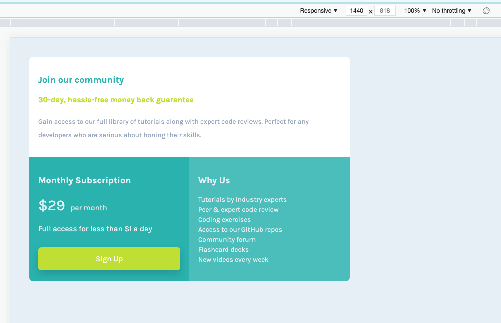

# Frontend Mentor - Single price grid component solution

This is a solution to the [Single price grid component challenge on Frontend Mentor](https://www.frontendmentor.io/challenges/single-price-grid-component-5ce41129d0ff452fec5abbbc). Frontend Mentor challenges help you improve your coding skills by building realistic projects. 

## Table of contents

- [Overview](#overview)
  - [The challenge](#the-challenge)
  - [Final Outcome](#final-outcome)
  - [Links](#links)
- [My process](#my-process)
  - [Built with](#built-with)
  - [What I learned](#what-i-learned)
- [Author](#author)

## Overview

### The challenge

Users should be able to:

- View the optimal layout for the component depending on their device's screen size
- See a hover state on desktop for the Sign Up call-to-action

### Final Outcome

Screen_Mobile_375  

Screen_LMobile_425  

Screen_Tablet_768  

Screen_Laptop_1024  

Screen_LLaptop_1440  

### Links

- Solution URL: [Github Repo](https://github.com/archana-nagaraj/Frontend-Mentor-Single-Price-Grid-Component)
- Live Site URL: [Github Pages](https://archana-nagaraj.github.io/Frontend-Mentor-Single-Price-Grid-Component/)

## My process

### Built with

- Semantic HTML5 markup
- CSS custom properties
- CSS Grid
- Mobile-first workflow

### What I learned

- practiced using rems all through the css
- creating variables and using it in various places 
 ' --white: hsl(0, 0%, 100%);
  --light-Cyan: hsl(179, 47%, 52%);
  --Cyan: hsl(179, 62%, 43%);
  --Bright-Yellow: hsl(71, 73%, 54%);
  --dark-Yellow: hsl(71, 73%, 40%);
  --Light-Gray: hsl(204, 43%, 93%);
  --Grayish-Blue: hsl(218, 22%, 67%);
  /* 18px */
  --padding: 1.12rem;
}'
- using grid
- using colors 

## Author

- Frontend Mentor - [@archana-nagaraj](https://www.frontendmentor.io/profile/archana-nagaraj)
- Github - [@archana-nagaraj](https://github.com/archana-nagaraj)
- Email - [archana.nagaraj](archana.nagaraj@gmail.com)

**Had fun building!** 🚀